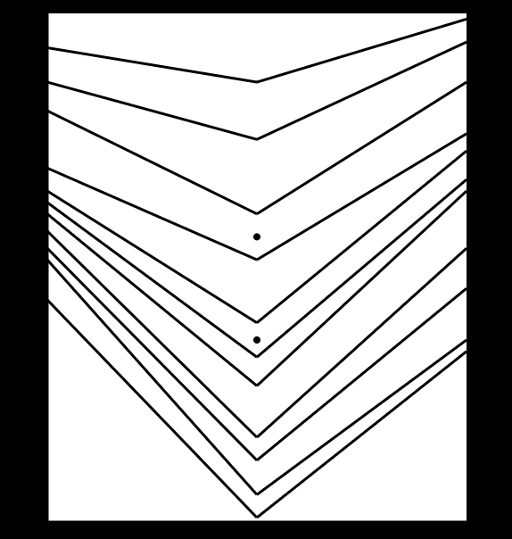
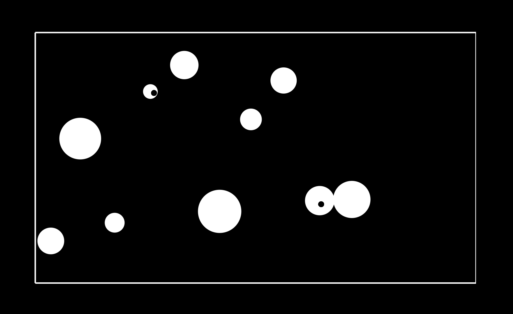
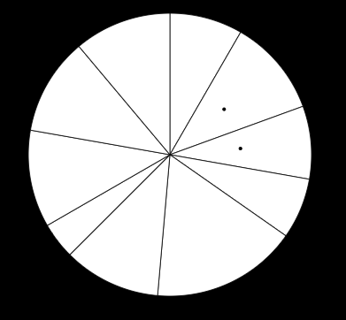
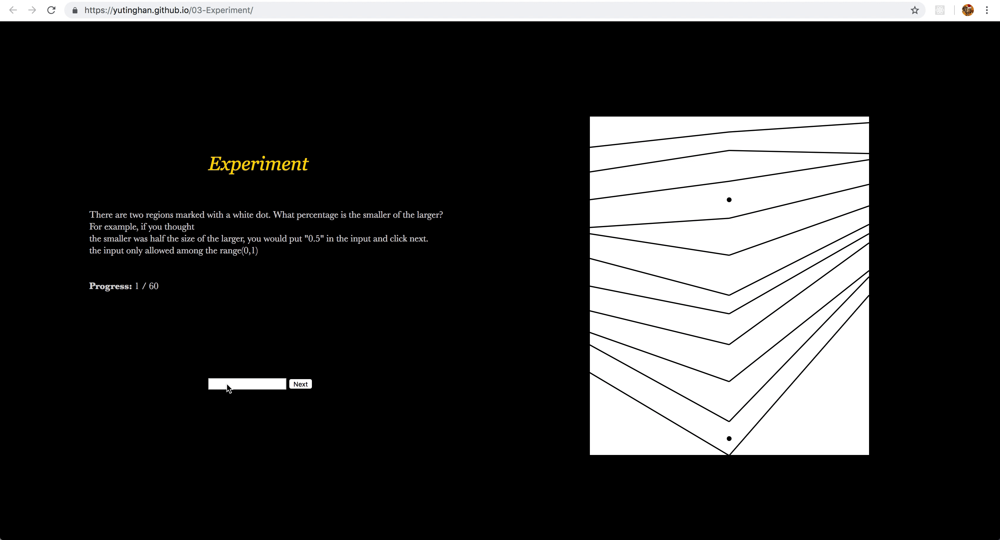
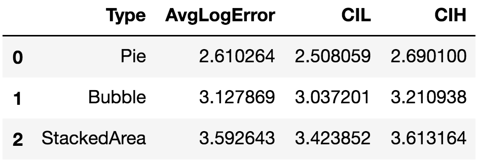

Assignment 3 - Replicating a Classic Experiment  
===
Meijie Wang, Yuting Han, Zhiyi Huang
-------

Survey Link: 
https://yutinghan.github.io/03-Experiment

A controlled experiment to test human perception of graphic area is built following the style from Cleveland and McGill's 1984 paper closely. Three competing visualizations are chosen: Stacked Area Chart, Bubble Chart and Pie Chart. In each chart, 10 randomly generated white regions are presented and 2 of them indicated by black dots are randomly chosen for area comparison.

This experiment is run with 20 trials per visualization type and is supported by 13 participants. To implement the performance, the error calculation function from Cleveland and McGill's 1984 paper is used.

Error=log2( | judged percent - true percent | + 1/8 )

The average error and Bootstrapped 95% confidence intervals are analyzed.

Three competing visualizations
===
Three competing visualizations are built by d3 and generated with random datasets.
When generating the random dataset, the lower and higher bounds are set to make sure the readability. 

Stacked Area Chart
------
Stacked area chart is often used to compare multiple variables' changing over an interval and the area bewtween lines is an important quantitative variable presented.

When building the visualization model, 11 lines are drawing to construct 10 areas and for simplicity, 3 points are created in each line.
To simulate the real data and reflect a trend, the middle point is set lower than the other two points.

Bubble Chart
-------
Bubble chart is a variation of a scatter chart and the areas of bubbles present one dimension of data.

To eliminate the interference that participants may judge the radius of each bubble rather than the area, the two black dots are draw at at random position rather than the center.

Pie Chart
------
Pie chart is one of the most commonly used chart and the areas of slices illustrate numerical proportions.

Experiment
===
Participants are asked to input the value that the smaller area over the larger area. The value ranges from 0 to 1 and the invalid value will be alerted.
There are 20 trials per chart and these 60 trials are presented in a random order.
Every time that the user clicks the "Next" button, the data will be stored and the next trial will appear.

When 60 trials finished, all data will be presented on the screen for the record.

Results
===
Average Log Error
------
Below is the average log error visualization, ordered by the best performance to the worst performance.
Pie chart has the lowest average error, following by bubble chart and stacked area chart.

Log Error Bootstrapped 95% Confidence Intervals
------
To generate more samples with the exsited dataset, bootstrap is used.
When estimating the unknown log errors, confidence interval provides the potential values and 95% CI is used.
The result is consistent with the average log error.

Discussion 
------

- Pie chart has the best performance with the lowest average log error in this experiment and people are more sensitve of the areas in it. However, this result may not be contributed by the sector shape since people may judge the area based on angles.

- Bubble chart has a lower performance than pie chart. This result is consistent with Cleveland & McGill's result.

- Stacked area chart has the lowest performance among three visualization and has the highest average log error. People are less sensitive to areas of irregular polygon, which may be the reason of this result.

Technical Achievements
===
- Input textbox range limitation

     > The textbox expects to receive a value ranging from 0 to 1. If not, an alert dialog box will pop up.
   
- Data type Transformation

     > When analyzing data, .csv files are transformed into a pandas.dataframe for a better implementation.
   
- Python functions construction

     > Both bootstrap and confidence interval functions are written from scratch in python
   
- Seaborn

     > Seaborn library is utilized to visualize the result in python.
   
- Jupyter notebook

     > When analyzing data, jupyter notebook is used to create code with results and visualizations.

Design Achievements
===
- Readability

     > A lower bound and a higher bound of area dataset in each visualization are set to make sure the readability.
   
- Javascript functions

     > Javascript functions are split into multiple files for easy implementation.
   
- Less is more

     > Redundant line and borders are removed when drawing three competing charts.
   

Reference:
-----
- Cleveland, W. S., & McGill, R. (1984). Graphical perception: Theory, experimentation, and application to the development of graphical methods. Journal of the American statistical association, 79(387), 531-554.
- Harrison, L., Skau, D., Franconeri, S., Lu, A., & Chang, R. (2013, April). Influencing visual judgment through affective priming. In Proceedings of the SIGCHI Conference on Human Factors in Computing Systems (pp. 2949-2958). ACM.

